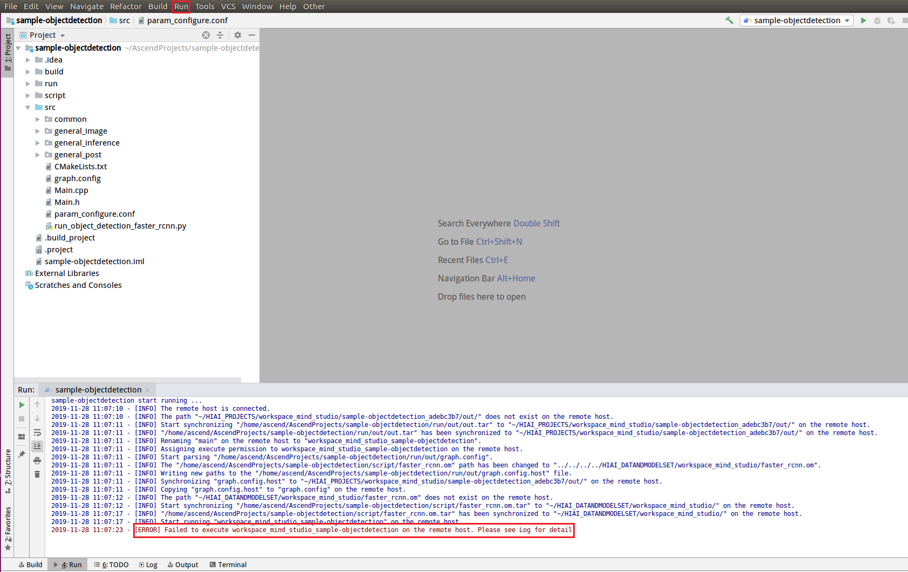

# Faster-R-CNN检测网络应用<a name="ZH-CN_TOPIC_0208837806"></a>

本Application支持运行在Atlas 200 DK或者AI加速云服务器上，实现了对faster-rcnn目标检测网络的推理功能。

## 前提条件<a name="zh-cn_topic_0203223280_section137245294533"></a>

部署此Sample前，需要准备好以下环境：

-   已完成Mind Studio的安装。
-   已完成Atlas 200 DK开发者板与Mind Studio的连接，交叉编译器的安装，SD卡的制作及基本信息的配置等。

## 软件准备<a name="zh-cn_topic_0203223280_section181111827718"></a>

运行此Sample前，需要按照此章节获取源码包，并进行相关的环境配置。

1.  <a name="zh-cn_topic_0203223280_li953280133816"></a>获取源码包。

    将[https://gitee.com/Atlas200DK/sample-objectdetection/tree/1.3x.0.0/](https://gitee.com/Atlas200DK/sample-objectdetection/tree/1.3x.0.0/)仓中的代码以Mind Studio安装用户下载至Mind Studio所在Ubuntu服务器的任意目录，这两个文件必须存放到同一个目录下。例如代码存放路径为：_$HOME/AscendProjects/sample-objectdetection_。

2.  <a name="zh-cn_topic_0203223280_li2074865610364"></a>获取此应用中所需要的原始网络模型。

    参考[表1](#zh-cn_topic_0203223280_table19942111763710)获取此应用中所用到的原始网络模型及其对应的权重文件，并将其存放到Mind Studio所在Ubuntu服务器的任意目录，这两个文件必须存放到同一个目录下。例如：_$HOME/models/faster\_rcnn_。

    **表 1**  检测网络应用使用模型

    <a name="zh-cn_topic_0203223280_table19942111763710"></a>
    <table><thead align="left"><tr id="zh-cn_topic_0203223280_row611318123710"><th class="cellrowborder" valign="top" width="11.959999999999999%" id="mcps1.2.4.1.1"><p id="zh-cn_topic_0203223280_p81141820376"><a name="zh-cn_topic_0203223280_p81141820376"></a><a name="zh-cn_topic_0203223280_p81141820376"></a>模型名称</p>
    </th>
    <th class="cellrowborder" valign="top" width="8.07%" id="mcps1.2.4.1.2"><p id="zh-cn_topic_0203223280_p13181823711"><a name="zh-cn_topic_0203223280_p13181823711"></a><a name="zh-cn_topic_0203223280_p13181823711"></a>模型说明</p>
    </th>
    <th class="cellrowborder" valign="top" width="79.97%" id="mcps1.2.4.1.3"><p id="zh-cn_topic_0203223280_p1717182378"><a name="zh-cn_topic_0203223280_p1717182378"></a><a name="zh-cn_topic_0203223280_p1717182378"></a>模型下载路径</p>
    </th>
    </tr>
    </thead>
    <tbody><tr id="zh-cn_topic_0203223280_row1119187377"><td class="cellrowborder" valign="top" width="11.959999999999999%" headers="mcps1.2.4.1.1 "><p id="zh-cn_topic_0203223280_p7118189378"><a name="zh-cn_topic_0203223280_p7118189378"></a><a name="zh-cn_topic_0203223280_p7118189378"></a>faster_rcnn</p>
    </td>
    <td class="cellrowborder" valign="top" width="8.07%" headers="mcps1.2.4.1.2 "><p id="zh-cn_topic_0203223280_p151818183718"><a name="zh-cn_topic_0203223280_p151818183718"></a><a name="zh-cn_topic_0203223280_p151818183718"></a>目标检测网络模型。</p>
    <p id="zh-cn_topic_0203223280_p11121816373"><a name="zh-cn_topic_0203223280_p11121816373"></a><a name="zh-cn_topic_0203223280_p11121816373"></a>是基于Caffe的Faster RCNN模型。</p>
    </td>
    <td class="cellrowborder" valign="top" width="79.97%" headers="mcps1.2.4.1.3 "><p id="zh-cn_topic_0203223280_p611318163718"><a name="zh-cn_topic_0203223280_p611318163718"></a><a name="zh-cn_topic_0203223280_p611318163718"></a>请参考<a href="https://gitee.com/HuaweiAscend/models/tree/master/computer_vision/object_detect/faster_rcnn" target="_blank" rel="noopener noreferrer">https://gitee.com/HuaweiAscend/models/tree/master/computer_vision/object_detect/faster_rcnn</a>目录中README.md下载原始网络模型文件及其对应的权重文件。</p>
    </td>
    </tr>
    </tbody>
    </table>

3.  以Mind Studio安装用户登录Mind Studio所在Ubuntu服务器，确定当前使用的DDK版本号并设置环境变量DDK\_HOME，tools\_version，NPU\_DEVICE\_LIB和LD\_LIBRARY\_PATH。
    1.  <a name="zh-cn_topic_0203223280_zh-cn_topic_0203223294_li61417158198"></a>查询当前使用的DDK版本号。

        可通过Mind Studio工具查询，也可以通过DDK软件包进行获取。

        -   使用Mind Studio工具查询。

            在Mind Studio工程界面依次选择“File \> Settings \> System Settings \> Ascend DDK“，弹出如[图 DDK版本号查询](zh-cn_topic_0203223294.md#fig94023140222)所示界面。

            **图 1**  DDK版本号查询<a name="zh-cn_topic_0203223280_zh-cn_topic_0203223294_fig17553193319118"></a>  
            

            其中显示的**DDK Version**就是当前使用的DDK版本号，如**1.31.T15.B150**。

        -   通过DDK软件包进行查询。

            通过安装的DDK的包名获取DDK的版本号。

            DDK包的包名格式为：**Ascend\_DDK-\{software version\}-\{interface version\}-x86\_64.ubuntu16.04.tar.gz**

            其中**software version**就是DDK的软件版本号。

            例如：

            DDK包的包名为Ascend\_DDK-1.31.T15.B150-1.1.1-x86\_64.ubuntu16.04.tar.gz，则此DDK的版本号为1.31.T15.B150。

    2.  设置环境变量。

        **vim \~/.bashrc**

        执行如下命令在最后一行添加DDK\_HOME及LD\_LIBRARY\_PATH的环境变量。

        **export tools\_version=_1.31.X.X_**

        **export DDK\_HOME=$HOME/.mindstudio/huawei/ddk/_1.31.X.X_/ddk**

        **export NPU\_DEVICE\_LIB=$DDK\_HOME/../RC/host-aarch64\_Ubuntu16.04.3/lib**

        **export LD\_LIBRARY\_PATH=$DDK\_HOME/lib/x86\_64-linux-gcc5.4**

        > **说明：**   
        >-   **_1.31.X.X_**是[1](#zh-cn_topic_0203223280_zh-cn_topic_0203223294_li61417158198)中查询到的DDK版本号，需要根据查询结果对应填写，如**1.31.T15.B150**  
        >-   如果此环境变量已经添加，则此步骤可跳过。  

        输入**:wq!**保存退出。

        执行如下命令使环境变量生效。

        **source \~/.bashrc**

4.  将原始网络模型转换为适配昇腾AI处理器的模型。
    1.  在Mind Studio操作界面的顶部菜单栏中选择**Tool \> Convert Model**，进入模型转换界面。
    2.  在弹出的**Convert Model**操作界面中，进行模型转换配置。
        -   Model File选择[步骤2](#zh-cn_topic_0203223280_li2074865610364)中下载的模型文件，此时会自动匹配到权重文件并填写在Weight File中。
        -   Model Name填写为[表1](#zh-cn_topic_0203223280_table19942111763710)对应的**模型名称**：faster\_rcnn。

            

        -   Nodes配置中**Input Node**有两个，需要在第二行的节点的前两格中依次输入1,3。

            

        -   AIPP配置中**Input Image Size\[W\]\[H\]**分别修改为896、608，此处需要128\*16对齐,**Model Image Format**  选择BGR888\_U8,其他使用默认值。

            

    3.  单击Finish开始转换模型。

        模型转换成功后，后缀为.om的离线模型存放地址为_$HOME/modelzoo/fast\_rcnn__/device_。

5.  将转换好的模型文件（.om文件）上传到[步骤1](#zh-cn_topic_0203223280_li953280133816)中源码所在路径下的“**sample\_objectdetection/script**”目录下。

## 编译<a name="zh-cn_topic_0203223280_section3723145213347"></a>

1.  打开对应的工程。

    以Mind Studio安装用户在命令行中进入安装包解压后的“MindStudio-ubuntu/bin”目录，如$HOME/MindStudio-ubuntu/bin。执行如下命令启动Mind Studio。

    **./MindStudio.sh**

    启动成功后，打开**sample\_objectdetection**工程，如[图 打开objectdetection工程](#zh-cn_topic_0203223280_fig05481157171918)所示。

    **图 2**  打开objectdetection工程<a name="zh-cn_topic_0203223280_fig05481157171918"></a>  
    

    

2.  在**src/param\_configure.conf**文件中配置相关工程信息。

    **图 3**  配置文件路径<a name="zh-cn_topic_0203223280_fig0391184062214"></a>  
    

    该配置文件内容如下：

    ```
    remote_host=
    ```

    需要手动添加参数配置：

    remote\_host：Atlas 200 DK开发者板的IP地址。

    配置示例：

    ```
    remote_host=192.168.1.2
    ```

    > **说明：**   
    >-   注意参数填写时不需要使用“”符号。  

3.  开始编译，打开Mindstudio工具，在工具栏中点击**Build \> Build \> Build-Configuration**。如[图 编译操作及生成文件](zh-cn_topic_0203223280.md#fig1625447397)所示，会在目录下生成build和run文件夹。

    **图 4**  图4 编译操作及生成文件<a name="zh-cn_topic_0203223280_fig21857144016"></a>  
    

    

    > **说明：**   
    >首次编译工程时，**Build \> Build**为灰色不可点击状态。需要点击**Build \> Edit Build Configuration**，配置编译参数后再进行编译。  
    >  

4.  将需要推理的图片上传至Host侧任一属组为HwHiAiUser用户的目录。

    图片要求如下：

    -   格式：jpg、png、bmp。
    -   输入图片宽度：16px\~4096px之间的整数。
    -   输入图片高度：16px\~4096px之间的整数。


## 运行<a name="zh-cn_topic_0203223280_section1620073406"></a>

1.  在Mindstudio工具的工具栏中找到Run按钮，点击  **Run \> Run 'sample-objectdetection'**，如[图 程序已执行示意图](zh-cn_topic_0203223280.md#fig93931954162719)所示，可执行程序已经在开发板执行。

    **图 5**  图5 程序已执行示意图<a name="zh-cn_topic_0203223280_fig8208744013"></a>  
    

    

    以上报错信息请忽略，因为Mind Studio无法为可执行程序传参，上述步骤是将可执行程序与依赖的库文件部署到开发者板，此步骤需要ssh登录到开发者板至相应的目录文件下手动执行，具体请参考以下步骤。

2.  在Mind Studio所在Ubuntu服务器中，以HwHiAiUser用户SSH登录到Host侧。

    **ssh HwHiAiUser@**_host\_ip_

    对于Atlas 200 DK，host\_ip默认为192.168.1.2（USB连接）或者192.168.0.2（NIC连接）。

3.  进入faster-rcnn检测网络应用的可执行文件所在路径。

    命令举例如下：

    cd \~/HIAI\_PROJECTS/workspace\_mind\_studio/sample\_objectdetection\_28ac8121/out

4.  执行应用程序。

    执行run\_object\_detection\_faster\_rcnn.py脚本会将推理生成的图片保存至指定路径。

    命令示例如下所示：

    python3 run\_object\_detection\_faster\_rcnn.py -w  _800_  -h  _600_  -i

    _./example.jpg_  -o  _./out_  -c  _21_

    -   -w/model\_width：模型的输入图片宽度，为16\~4096之间的整数。
    -   -h/model\_height：模型的输入图片高度，为16\~4096之间的整数。
    -   -i/input\_path：输入图片的目录/路径，可以有多个输入。
    -   -o/output\_path：输出图片的目录，默认为当前目录。
    -   -c/output\_categories：faster\_rcnn检测的类别数\(包含背景\)，为2\~32之间的整数，默认为值为21。

5.  其他详细参数请执行python3 run\_object\_detection\_faster\_rcnn.py --help命令参见帮助信息。

